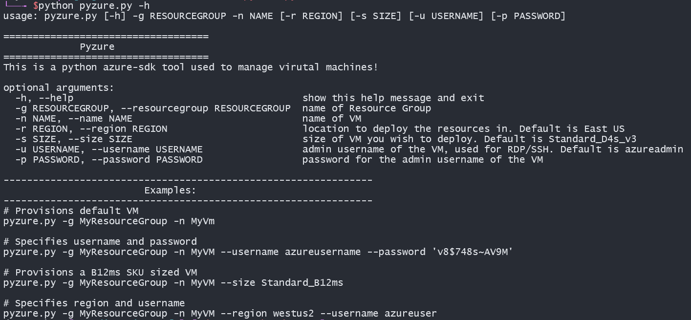

# Pyzure

I created pyzure on my freetime to quickly create resources in Azure, mainly virtual machines. I spend alot of time deploying virtual machines in my day job and saw that it was possible to interact with Azure through python using the Azure SDK for python library. I thought that was pretty cool so I created this. It was a fun way for me to practice my l337 c0d1ng sk1llz and create a tool I use everyday. I plan on adding more features in the future, as time allows, like allowing different images to be deployed or create different types of resources. As of now, the only image available is Ubuntu 20.04LTS.

If you have a feature request send them my way, or go ahead and make a pull request. Keep in mind, I'm just one dude.

<div align="center">
  <kbd>
    
  </kbd>
</div>

## Description

Pyzure is a tool to create reasources in Azure using python. It works by using the Azure-SDK for Python library https://github.com/Azure/azure-sdk-for-python. As of now it only creates a Gen 2 - Ubuntu 20.04-LTS Virutal Machine and its network depencies (nic, subnet, public-ip, vnet). Its capable of deploying in an existing resource group or creating a new one.

### Features

- Create a virutal machine and its network dependencies
- Create a new Resource Group to store resources or use an existing one
- Only deploys an Ubuntu 20.04-LTS image.

### Built with

- Azure SDK for Python.
- Love, time, and effort.

## Getting started

### Prerequisites

- An active Azure subscription.

- Azure CLI or a Service Priciple.

### Authentication

This script uses ```DefaultAzureCredential``` object of the azure-identity library for authentication.
One way to authenticate is to use Azure CLI. The other way is to create a service priciple and
setting some environment variables preferably in a virtual environment but this is not required.

- Azure CLI: https://docs.microsoft.com/en-us/azure/developer/python/configure-local-development-environment?tabs=cmd#sign-in-to-azure-from-the-cli

- Service Principle: https://docs.microsoft.com/en-us/azure/developer/python/configure-local-development-environment?tabs=cmd#configure-authentication

#### <u>Azure CLI</u>

If you have Azure CLI already downloaded just simply sign in:

<b>Azure CLI</b>:
```bash
$ az login
```


#### <u>Service Priciple</u>

If you choose to authenticate with a Service priciple you will have to set
environment variables. I highly recommend you use a virtual enviornment as
it will not persist in your actual enviornment and you won't have a secret
stored in your enviornment variables indefinetly. Although it's not needed.

See here to create a virtual enviornment with python:
https://docs.microsoft.com/en-us/azure/developer/python/configure-local-development-environment?tabs=cmd#use-python-virtual-environments

<u>Create Service Principle</u>:

You can manually create a service principle with the 
Azure portal or CLI in the CloudShell:
https://docs.microsoft.com/en-us/azure/developer/python/configure-local-development-environment?tabs=cmd#create-a-service-principal-and-environment-variables-for-development

<b>CloudShell</b>:
```bash
$ az ad sp create-for-rbac --name localtest-sp-rbac
```

<u>Create a Virtual Enviornment</u>:

<b>Linux</b>:
```bash
$ python3 -m venv myvenv
$ cd myvenv
$ source bin/activate
```

<b>Windows</b>:
```cmd
py -3 -m venv myvenv
cd myvenv
scripts\activate
```


<u>Set your enviornment variables</u>:

*NOTE:* you can find all these IDs in the portal: 
Azure Active Directory > Owned applications > "localtest-sp-rbac" > Overview\
Secret can be found under: Certificates and secrets > Client secrets.

<b>Linux</b>:
```bash
AZURE_SUBSCRIPTION_ID="aa11bb33-cc77-dd88-ee99-0918273645aa" 
AZURE_TENANT_ID="00112233-7777-8888-9999-aabbccddeeff"
AZURE_CLIENT_ID="12345678-1111-2222-3333-1234567890ab" <-- this is also known as your "Application ID"
AZURE_CLIENT_SECRET="oUBB11zz~JJJJ_~yyyyyyVVumumumumb_b"
```

<b>Windows</b>:
```cmd
set AZURE_SUBSCRIPTION_ID="aa11bb33-cc77-dd88-ee99-0918273645aa"
set AZURE_TENANT_ID=00112233-7777-8888-9999-aabbccddeeff
set AZURE_CLIENT_ID=12345678-1111-2222-3333-1234567890ab
set AZURE_CLIENT_SECRET=oUBB11zz~JJJJ_~yyyyyyVVumumumumb_b
```

### Install
Recommended to be done in your virtual enviornment.
- Download Repo:
```bash
(myvenv)$ git clone 
(myvenv)$ cd pyzure
```

- Install dependencies:
```bash
(myvenv)$ pip install -r requirements.txt
```

```bash
(myvenv)$ python pyzure.py -h
```

### Usage
Options in "[ ]" are optional. Default settings:

- Region - East US
- Size - Standard_D4s_v3
- Username - azureadmin
- Image: Ubuntu20.04-LTS


```bash
usage: pyzure.py [-h] -g RESOURCEGROUP -n NAME [-r REGION] [-s SIZE] [-u USERNAME] [-p PASSWORD]
```

### Troubleshooting

If you are getting a ```AttributeError: 'DefaultAzureCredential' object has no attribute 'signed_session'``` error, use a virtual enviornment and install dependcies in requirements.txt ```$pip install -r requirements.txt```.

### Legal disclaimer

Usage of this tool for attacking targets without prior mutual consent is illegal. It is the end user's responsibility to obey all applicable local, state, and federal laws. Developers assume no liability and are not responsible for any misuse or damage caused by this program.

